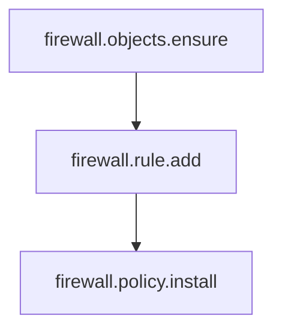

# xcfg Workflow (Diagram)

The diagram below shows the end-to-end request lifecycle from an intent-driven frontend (e.g., ServiceNow) through translation, execution, and async completion.

```mermaid
flowchart LR
  SNOW[ServiceNow / Frontend] -->|POST /v1/requests| API[xcfg HTTP API]

  API -->|validate envelope| ENG[Engine]
  ENG -->|translator type@version| PLAN[Execution Plan (IR)]
  PLAN --> STORE[(Request Store)]

  %% Execution
  PLAN --> RUN[Runner]
  RUN -->|execute task| ADP[Backend Adapter]
  ADP -->|vendor API calls| VEND[Backend API]

  %% Async completion paths
  VEND -->|webhook callback| CB[/POST /v1/callbacks/{backend}/]
  CB --> STORE
  RUN -->|poll checkStatus(external_id)| VEND

  %% Read paths for status
  SNOW -->|GET /v1/requests/{request_id}\nGET /v1/requests?idempotency_key=...| API
  API --> STORE
  STORE --> API
  API --> SNOW

  %% Audit/metrics
  ENG --> AUDIT[(Audit Events)]
  ENG --> METRICS[(Metrics)]
```

## DAG Execution (Plan Dependencies)

Execution Plans are **DAGs** of tasks. A task may declare dependencies via `depends_on`.



- A task runs only after all `depends_on` tasks are `succeeded`.
- If a task returns `running`, dependent tasks remain `queued` until polling/callback updates it to `succeeded`.

