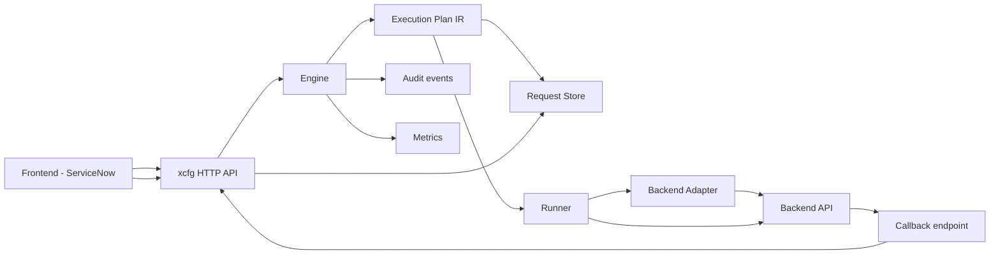
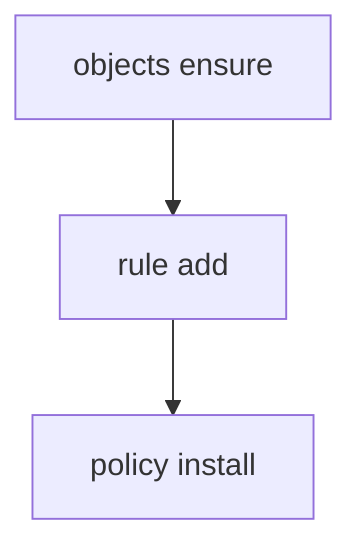

# xcfg Workflow (Diagram)

The diagram below shows the end-to-end request lifecycle from an intent-driven frontend (e.g., ServiceNow) through translation, execution, and async completion.

## DAG Execution (Plan Dependencies)

Execution Plans are **DAGs** of tasks. A task may declare dependencies via `depends_on`.

- A task runs only after all `depends_on` tasks are `succeeded`.
- If a task returns `running`, dependent tasks remain `queued` until polling/callback updates it to `succeeded`.
